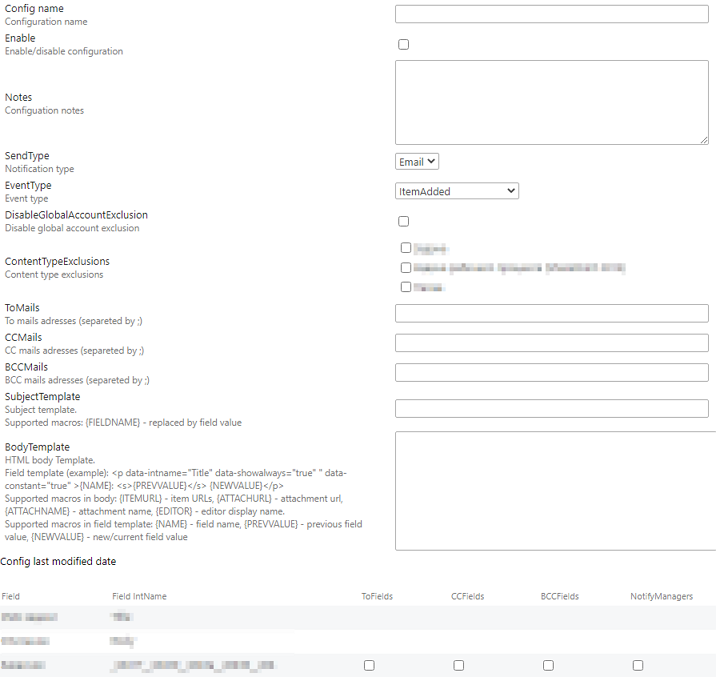

# Description
This solution creates a custom SharePoint notifications Event Receiver (ER) that offers more flexible functionalities compared to default notifications.

### Features:
1. Project creates .wsp solution file which installed in SP and activated as feature in per web basis
1. Solution contains 5 subprojects each for particular purposes
1. ER parameters are defined in list settings in entry "ER Lists Notifications" (note: not all types of lists has this feature but most of common - defined in project)
1. Solution adds to SharePoint 4 pages (after activating feature "SPEventReceiverNotificationsLayouts Feature1"​):
  * ListConfigs.aspx - page with all list's configs
  * ConfigEdit.aspx - contains ER parameters
  * GlobalConfigEdit.aspx - global settings (common to all site collection lists)
  * SiteAllConfigs.aspx - list of all ER configs from all lists of site collection
5. Main parameters:
  * SendType - notification type (for now only Email)​
  * EventType - list of event types (ItemAdded, ItemUpdating, AttachmentAdded)
  * DisableGlobalAccountExclusion - disables global accounts exclusions (ex. service accounts: "app@sharepoint", svc_*)
  * ContentTypeExclusions - don't send notifications to checked content types
  * ToMails, CCMails​, BCCMails - email addresses separated by ";", added to corresponding email fields (to, cc, bcc)
  * SubjectTemplate​ - subject template, supports macros {FIELDNAME}
  * Notification settings table, headers/options: 
  * ToFields, ССFields​, BCCFields - adds field's participants to corresponding email field (to, cc, bcc)
  * NotifyManagers - adds field's participants managers to email "to" field
  * BodyTemplate - body template, consists from arbitrary content and fields templates
  * Field template example: 
  ```
  <span data-intname="Title" data-showalways="true" data-constant="true" >{NAME}: <s>{PREVVALUE}</s> {NEWVALUE}</span>
  ```
  - Field template attributes:
	- data-showalways - always show field's value undependetly from changes (if data-showalways="false" field template will be hidden)
	- data-constant - always show field's value without tracking changes
6. Supported macro in body template:
  * {ITEMURL} - item URL
  * {ATTACHURL} - attachment URL
  * {ATTACHNAME} - attachment name
  * {EDITOR} - editor display name
7. Supported macro in field template:
  * {NAME} - field display name (Title)
  * {PREVVALUE} - previous field value
  * {NEWVALUE} - new/current field value
8. Field body template example:
```
<!DOCTYPE html>
<html>
	<style>
        body {
			font-size: 12pt;
			font-family: Segoe UI Light,sans-serif;
			color: #444444;
		}
		#itemurl {
			font-size: 14pt;
		}
	</style>
	<body>
		<p><span data-intname="Title" >{NAME}: <s>{PREVVALUE}</s> {NEWVALUE}</span></p>
		<p><span data-intname="AssignedTo" data-showalways="true" >{NAME}: <s>{PREVVALUE}</s> {NEWVALUE}</span></p>
		<p><span data-intname="EventDate" data-constant="true" >{NAME}: {NEWVALUE}</span></p>
		<p><span data-intname="Title" data-constant="true" >Item: <a id="itemurl" href="{ITEMURL}">{NEWVALUE}</a> </span></p>
	</body>
</html>
```

### Screenshots
Main settings page:



## Disclaimer
**THIS CODE IS PROVIDED _AS IS_ WITHOUT WARRANTY OF ANY KIND, EITHER EXPRESS OR IMPLIED, INCLUDING ANY IMPLIED WARRANTIES OF FITNESS FOR A PARTICULAR PURPOSE, MERCHANTABILITY, OR NON-INFRINGEMENT.**